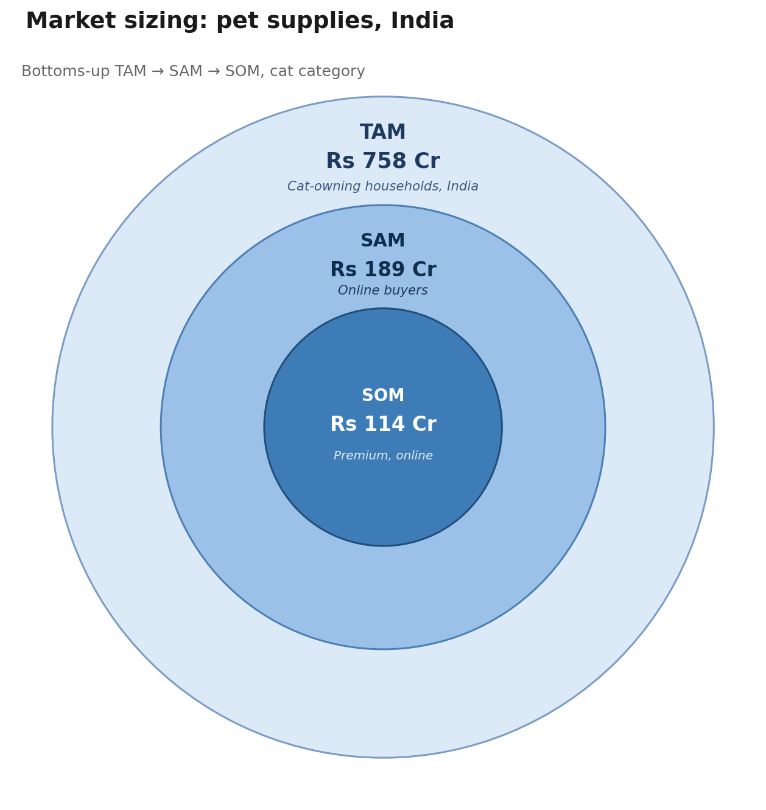

# Premium Pet Accessories — Segmentation & GTM Sizing (India E-Commerce)

## What this is
An analysis of 343 pet product listings from Amazon.in, built to answer a specific question: **which pet product segment should an e-commerce entrant prioritize in India?** Rather than relying on a single industry market-size figure, this project combines real transaction-level data (EDA + segmentation) with a bottoms-up TAM-SAM-SOM model, cross-checked against top-down industry estimates.

## Key finding
What's actually sold on general e-commerce (Amazon.in) for pets doesn't match what's owned or spent on in India. Dogs and food — the two largest pieces of the real Indian pet economy — are both underrepresented in this catalog, while toys and accessories for cats, birds, and small animals dominate instead. Combined with a fragmented, largely unbranded competitive field, this points to a real whitespace: **Premium-tier cat accessories, sold online**, is a segment with both demonstrated demand in this data and limited branded competition.

## What I did
1. Cleaned and structured 343 raw Amazon.in pet product listings (price formatting, brand extraction, category parsing from breadcrumbs)
2. Ran EDA to surface category, price, and brand distribution patterns
3. Segmented products by price tier (Budget / Mid / Premium) and animal type
4. Built a bottoms-up TAM-SAM-SOM sizing model using real India pet-ownership data cross-referenced with this dataset's pricing
5. Compared bottoms-up sizing against top-down industry estimates as a sanity check
6. Translated the findings into a specific GTM recommendation

## Findings

**EDA**
- Dogs make up only 1.2% of listings (4 of 343), despite being the largest pet-owning segment in India by most market research — a representativeness gap, not a reflection of actual ownership
- Toys (82 listings) outnumber Food (36) — this catalog skews toward accessories, not the consumables that dominate most pet-market spend
- Price distribution is right-skewed (mean ₹1,885 vs. median ₹969) — a handful of high-price outliers pull the average up
- "Generic" is the single largest brand label, at 23% of listings — no dominant player, and nearly a quarter of the catalog isn't meaningfully branded

**Segmentation** (price tiers: Budget <₹603, Mid ₹603–1,500, Premium >₹1,500)
- Cats (38%) and Small Animals (42%) skew Premium
- Birds skews Budget (38% Budget, only 28% Premium)
- Dogs excluded from tier conclusions — only 3 priced listings, not statistically meaningful

**Market sizing** (bottoms-up, cat-owning households, India)

| | Population | Avg price | Frequency/yr | Value |
|---|---|---|---|---|
| TAM | 1.9M cat-owning households | ₹997 | 4x *(sourced)* | ₹758 Cr (~$91M) |
| SAM | 475K buying online | ₹997 | 4x | ₹189 Cr (~$23M) |
| SOM | 181.5K, Premium tier online | ₹3,132 | 2x *(assumption, flagged)* | ₹114 Cr (~$13.5M) |

Top-down industry estimates for India's total pet care market range from $720M to $10.5B depending on source and scope — a ~10x spread. The bottoms-up TAM sits well below the broadest of these, which is directionally consistent (cats + product retail is one slice of a much larger multi-species, multi-channel market), rather than a precise match.

## GTM recommendation

**Prioritize Premium-tier cat accessories as the entry segment for online pet product sales in India.**

Why this segment specifically:
- Highest Premium-tier concentration among statistically meaningful animal categories (38% of Cat listings are Premium — only Small Animals rank higher at 42%, but Cats have a larger addressable base: 140 listings vs. 52)
- Aligns with the external trend already confirmed in research — pet humanization and premiumization are accelerating in India, with cats fitting well into the urban, apartment-living lifestyle driving new pet ownership
- Fragmented competitive field (no dominant brand, 23% of listings unbranded "Generic") — lower barrier to entry than competing in a category with an established leader
- Quantified opportunity: ₹114 Cr SOM — a credible near-term target, not an inflated headline number

What this recommendation deliberately does not claim:
- It does not say "enter the dog market" or "enter the food market" — even though both are larger overall, this dataset can't validate demand there given severe underrepresentation
- It does not treat the ₹114 Cr SOM as guaranteed capture — it's a modeled ceiling based on a partly-assumed purchase frequency, not a revenue forecast

Suggested next step: validate the assumed 2x/year Premium purchase frequency with actual repeat-purchase data before committing budget — the single weakest input in the model, and the cheapest one to de-risk before scaling.

## Limitations
- Dataset is a 343-row sample, not a full market census — findings describe this catalog, not the whole Indian pet e-commerce market
- Purchase-frequency inputs are partly assumption-based: the base 4x/year figure is a global (not India-specific) e-commerce benchmark, and the 2x/year Premium-tier figure is an unsourced estimate, both explicitly flagged rather than presented as fact
- `specifications` field (which may contain Country of Origin — relevant to India's "Made in India" purchasing trend) was too inconsistently structured to reliably parse in scope; flagged as a phase-2 extension
- Dog-related findings are directional only, given the small sample (3–4 listings)

## Tools
Python (pandas) for cleaning, EDA, and segmentation. Manual bottoms-up modeling for TAM-SAM-SOM, cross-checked against secondary market research.
